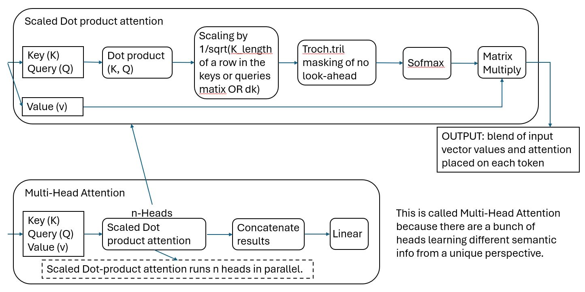
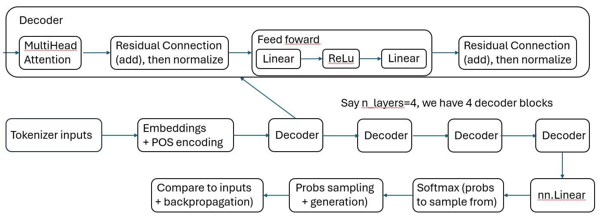

# Language Model
This is for learning of the architecture of transformer and training of Languate Model. The transformer is the Large Language Model's core architecture. The English letters are encoded for inputs. The outputs are decoded to show the predictions the English sentences. The GPT model understanding is based on the [tutorial video](https://www.youtube.com/watch?v=UU1WVnMk4E8&t=17196s). The FastAPI operation is based on the [API ML tutorial video](https://www.youtube.com/watch?v=EUWLdW_i0EQ&t=359s)

# The architecture of the transformer
The multi-head attention:
<p style="text-align:center;"></p>
The Block decoder and main architecture with 4 decoder blocks:
<p style="text-align:center;"></p>

# The training process
Because the GPU limiation, the training inputs are 8 block size.
## before training results
Before training I give input string of "Range Tr", then the results are:
```
$python train.py --mode test

Range Trp8-8Yr–h),2"D5LpFpQQ0p”T5r—GzkSzr-DO–H.+whRHw5AsrIHlqsHKD3D9uq”xaT0–3NAO:3Ejks&A:AXXSoGYaoLEi:IL’ps3“h8‘NH+T–)W
HnDof—XW—lDQtBhP”rXeH—F3FyLl5ODc8F(4‘bo ”—xwwl”MgvsahR+q”FeDm oTL
HSFhuFeOlikoTPLvBQ7”lR
```
The results do not make any sense. The model randomly predict characters.
## Training process
I use a text of trading strategies as example data to train. The text has quite few words, but is enough to see the training performance:
```
$python train.py --mode train

step: 0, train loss: 4.421607971191406, val loss: 4.421889305114746
step: 250, train loss: 2.4349820613861084, val loss: 2.476231336593628
step: 500, train loss: 2.2880406379699707, val loss: 2.3123316764831543
step: 750, train loss: 2.1936192512512207, val loss: 2.2296946048736572
step: 1000, train loss: 2.2029850482940674, val loss: 2.2179207801818848
step: 1250, train loss: 2.1297359466552734, val loss: 2.207047939300537
step: 1500, train loss: 2.1345341205596924, val loss: 2.166934013366699
step: 1750, train loss: 2.0419721603393555, val loss: 2.120746374130249
step: 2000, train loss: 2.042447566986084, val loss: 2.102712631225586
step: 2250, train loss: 2.0100271701812744, val loss: 2.034900665283203
step: 2500, train loss: 1.9968552589416504, val loss: 2.022982597351074
step: 2750, train loss: 1.9868792295455933, val loss: 2.0363478660583496
step: 3000, train loss: 1.9379197359085083, val loss: 2.0090527534484863
step: 3250, train loss: 1.9281163215637207, val loss: 1.9860751628875732
step: 3500, train loss: 1.916532278060913, val loss: 1.9947946071624756
step: 3750, train loss: 1.9360541105270386, val loss: 2.010404586791992
step: 4000, train loss: 1.9052958488464355, val loss: 2.028935432434082
step: 4250, train loss: 1.8985267877578735, val loss: 1.9835755825042725
step: 4500, train loss: 1.8937077522277832, val loss: 1.9673352241516113
step: 4750, train loss: 1.8853027820587158, val loss: 1.9772850275039673
step: 5000, train loss: 1.8912675380706787, val loss: 1.98234224319458
step: 5250, train loss: 1.891589641571045, val loss: 1.9878278970718384
step: 5500, train loss: 1.8902934789657593, val loss: 1.9770814180374146
step: 5750, train loss: 1.838560938835144, val loss: 1.9833117723464966
step: 6000, train loss: 1.8553110361099243, val loss: 1.91123366355896
step: 6250, train loss: 1.812317132949829, val loss: 1.9404957294464111
step: 6500, train loss: 1.833752155303955, val loss: 1.898629903793335
step: 6750, train loss: 1.8128032684326172, val loss: 1.8809409141540527
step: 7000, train loss: 1.7803735733032227, val loss: 1.9475181102752686
step: 7250, train loss: 1.7893543243408203, val loss: 1.899132490158081
step: 7500, train loss: 1.8021289110183716, val loss: 1.9077714681625366
step: 7750, train loss: 1.794412612915039, val loss: 1.919538140296936
step: 8000, train loss: 1.7916619777679443, val loss: 1.9093626737594604
step: 8250, train loss: 1.7802634239196777, val loss: 1.8944159746170044
step: 8500, train loss: 1.793629765510559, val loss: 1.8788360357284546
step: 8750, train loss: 1.7708022594451904, val loss: 1.895726203918457
step: 9000, train loss: 1.7717134952545166, val loss: 1.853831171989441
step: 9250, train loss: 1.742807149887085, val loss: 1.8570610284805298
step: 9500, train loss: 1.7292002439498901, val loss: 1.8803032636642456
step: 9750, train loss: 1.7212467193603516, val loss: 1.8275359869003296
```
The process above shows the loss reducing. This means the model is correct and the training is reasonable.
## Results after training
Let's see the results after training with giving inputs "Rang Tr"
```
Range Trades inf traders onciple market’s the tall-timing that every.
MoRk fincoting strategy
The man preding the overse sekins. The markets traderns to resessanst on the shigh a trends launchnice Trading sto
```
The results are still not very accurate. However, they are more reasonable. Some English words are correct. I think this shows the model is correct.

## Run the API
To start the model API,run the api with:
`$uvicorn model_api_test:app'
To test the model, in the front service terminal, run:
`$front_service.py --mode test`
To train the model, run:
`$front_service.py --mode train`


